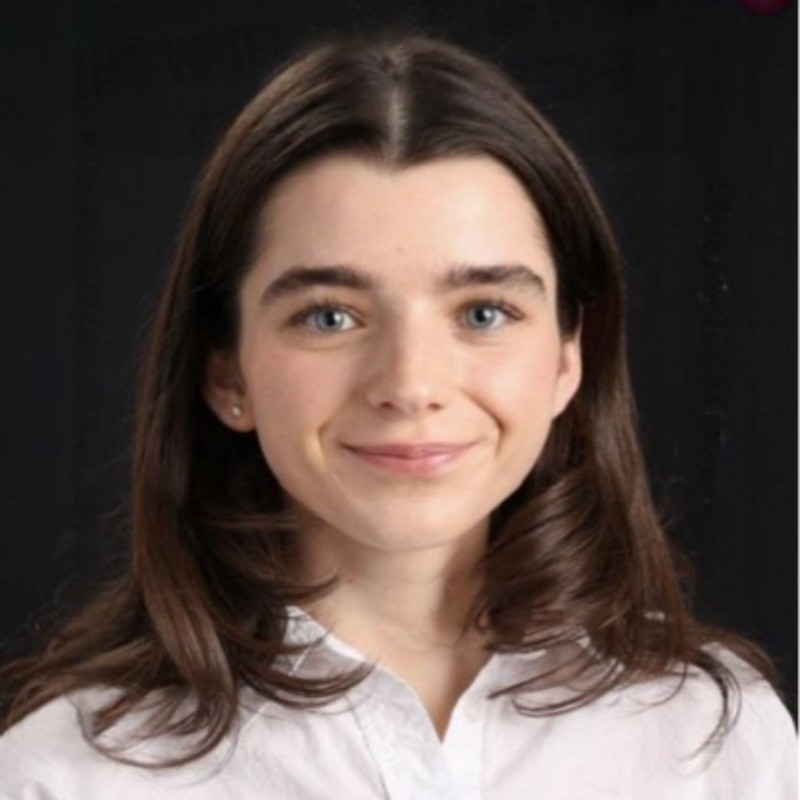

  

<h1 align="center"> Fiona Mackenzie</h1>
<h3 align="center">Mechanical and Materials Engineer</h3>

---

## About Me

I’m a fourth-year Mechanical and Materials Engineering student nearing graduation, with a strong passion for **problem-solving**, **mechanical systems**, and **continuous learning**. My experience involves **sustainable energy**, **computational fluid dynamics**, and **structural design**. I'm eager to apply my skills to impactful, real-world challenges.

---

## Projects

###  Green Hydrogen for Transportation  - 2022
For this project I was able to explore the use of green hydrogen as a clean energy source and I studied how it can be used for transportation in the future. Focused on **energy systems integration**, environmental impact, and infrastructure feasibility.

**Project Report:**
<a href="Green Hydrogen.pdf" target="_blank">
  View Green Hydrogen PDF
</a>

---

###  CFD Analysis – Flow Around the Leaning Tower of Pisa  - 2024
Throught this project **ANSYS Fluent** was used to mimic the airflow around the Leaning Tower of Pisa. this was was simulated in both two-dimensional and three-dimensional analysis, to understand the structural loading due to wind. The air was applied to the structure at multiple velocities, in order to determine the pressure and viscosity forces acting on the building. From the forces determined in the 2D flow, the force coefficients were then calculated and compared to the Reynolds numbers. With the results from the 3D simulations, the 2D and 3D results are compared are discussed.

**Project Report:** 
<a href="PisaTower.pdf" target="_blank">
  View PisaTower PDF
</a>

---

###  Capstone: Quag Hull Boat – Stiffness Optimization  - 2025
Fluidesign assigned us the task to create a prototype of their quad boat hull to increase **torsional** and **lateral stiffness**, with an adjustement to the dimensions and materials changes. This project consisted of three testing portions: First was the **vibration testing**, where the physical boat was hit with a rubber mallet, and the vibrations created were measured in different locations using a accelerometer, this testing provided us with the weak points along the hull. Next **FEA simulations** were performed using SolidWorks, where simulations of a row stroke where performed on a replicated version of the boat with new dimensions and new materials to ensure an increase in stiffness with finite element analysis. Finally, **material testing** was completed using carbon fiber samples and a three-point bend test to ensure the new materials increase stiffness.

**Project Report:**
<a href="QuadHullStiffness.pdf" target="_blank">
  View QuadHullStiffness PDF
</a>

---

##  Resume
Download My Resume:
<a href="FionaMackenzieResume.pdf" target="_blank">
  View My Resume
</a>
---

## Contact Me:

  **Email:** <a href="mailto:fionamackenzie0827@gmail.com">fionamackenzie0827@gmail.com</a> 
  
  **LinkedIn:** <a href="https://www.linkedin.com/in/fiona-mackenzie-046216240/" target="_blank">
  <i class="fab fa-linkedin"></i> LinkedIn
</a>

---

 Thank you for visiting my portfolio, please contact me if you have any further questions. 

